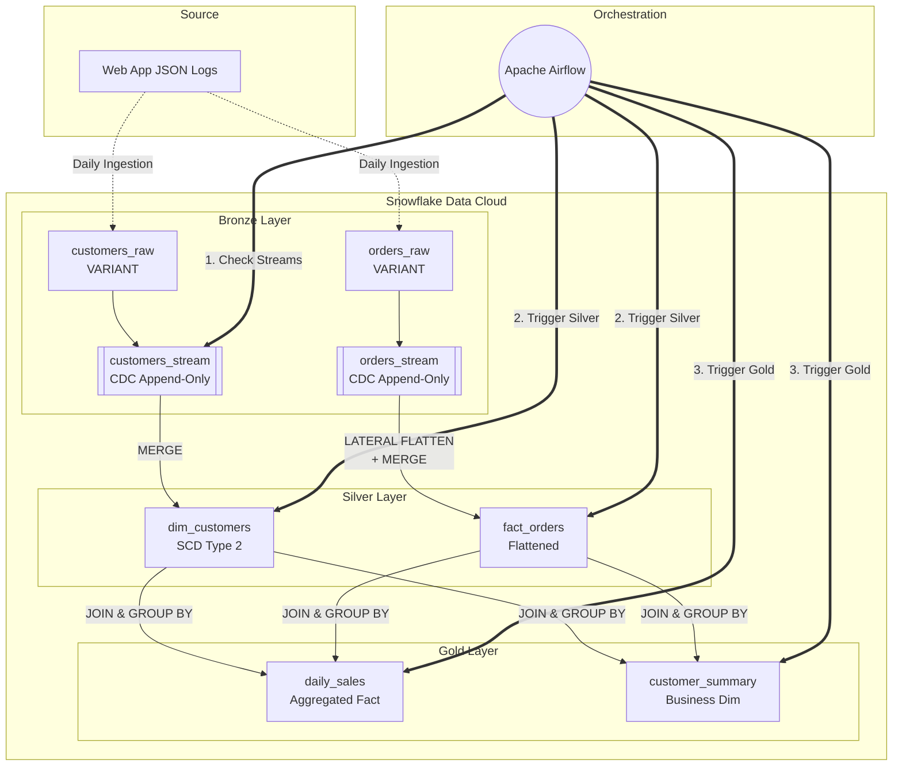

# SnowMart: Enterprise Data Engineering Pipeline

## 📖 Business Case
**SnowMart**, a rapidly growing regional e-commerce platform, was facing a critical data challenge. Their analytics team was struggling with static, delayed reports and was losing the historical context of customer behavior. For instance, when a customer moved to a new city, their entire purchase history was retroactively attributed to the new city, skewing geographic sales metrics.

**The Objective:** 
Design and implement an automated, production-grade data pipeline to:
1. Ingest highly nested, semi-structured JSON logs directly from the web application.
2. Track customer location history over time accurately without losing past context.
3. Serve daily aggregated insights for the business intelligence (BI) team.

## 🏗️ Architecture & Solution

To solve this, I designed a **Medallion Architecture (Bronze ➔ Silver ➔ Gold)** on Snowflake, orchestrated by **Apache Airflow**.



### 🛠️ Key Engineering Features
- **Change Data Capture (CDC):** Utilized native Snowflake `STREAMS` to incrementally process only new or changed data, minimizing compute costs.
- **Slowly Changing Dimensions (SCD Type 2):** Implemented historical tracking in the Silver layer using `start_date`, `end_date`, `is_current`, and `MD5` surrogate keys.
- **Semi-Structured Data Handling:** Processed nested arrays dynamically using `LATERAL FLATTEN` and `PARSE_JSON`.
- **Workload Isolation:** Designed Role-Based Access Control (RBAC) separating ETL workloads (`snowmart_etl_wh`) from Analytics workloads (`snowmart_bi_wh`).
- **Data Quality Framework:** Built automated validation checks for Completeness, Uniqueness, and Referential Integrity.

## 📁 Repository Structure

```text
├── 01_setup/                         # Infrastructure (RBAC, Warehouses, DBs, Schemas, Tables, Streams)
├── 02_bronze/                        # Data ingestion logic (Stages, COPY INTO)
├── 03_silver/                        # Silver layer logic (SCD2, JSON Flattening, Data Quality)
├── 04_gold/                          # Gold layer logic (Business Aggregations, Fact & Dim combinations)
├── 05_orchestration/                 # Apache Airflow DAG (Python) orchestrating the SQL pipeline
├── mock_data/                        # Day 1 & Day 2 realistic JSON data for CDC simulation
└── data_generator.py                 # Python script to generate realistic E-commerce JSON data
```

## 🚀 How to Run the CDC Simulation

1. **Generate Data:** Run `python data_generator.py` to create `day1` and `day2` JSON files.
2. **Setup Environment:** Execute scripts in `01_setup` sequentially in Snowflake.
3. **Day 1 (Initial Load):** Load `day1` JSON files into Bronze tables. Run Silver and Gold transformations manually or via Airflow.
4. **Day 2 (CDC in Action):** Load `day2` JSON files. Notice how Airflow triggers the Pipeline, Snowflake Streams capture the deltas, and SCD2 handles customer address changes automatically!
