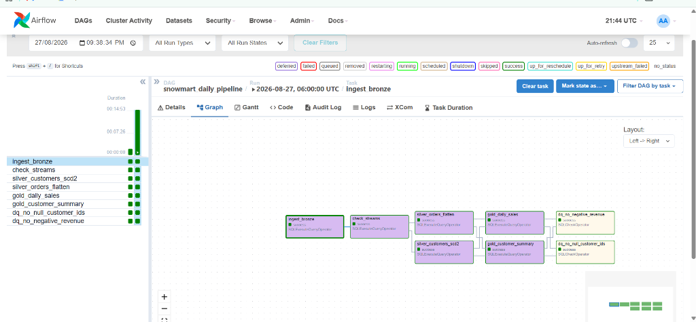
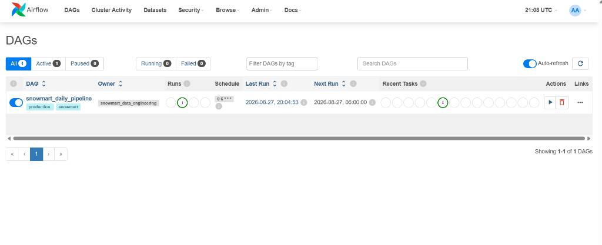
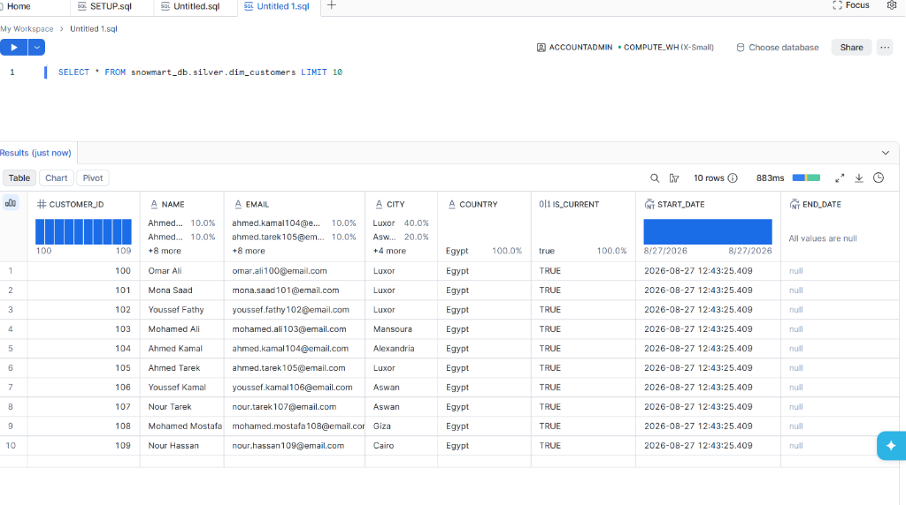
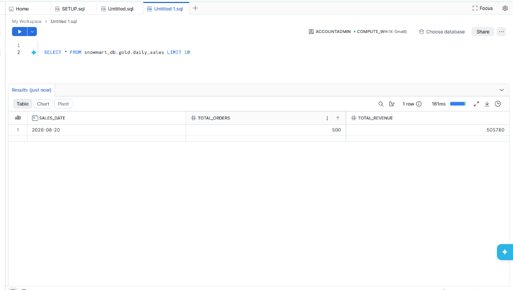
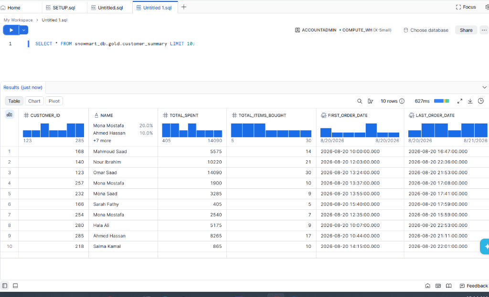

# SnowMart Data Pipeline

An end-to-end, production-style Data Engineering pipeline built on **Snowflake** and orchestrated by **Apache Airflow**.

The pipeline ingests raw e-commerce JSON data, processes it through a **Medallion Architecture** (Bronze -> Silver -> Gold), and runs automated data quality checks at the end of every run.

---

## Architecture

```
[ Raw JSON Data ]
        |
        v  (Airflow: COPY INTO Bronze)
[ Bronze Layer ]  -- customers_raw, orders_raw (VARIANT)
        |
        v  (Snowflake Streams: CDC)
[ Streams ]  -- Capture only new/changed rows
        |
        |---------------------------------------|
        v  (Airflow: Silver SQL)                v  (Airflow: Silver SQL)
[ dim_customers ]                         [ fact_orders ]
  SCD Type 2                               LATERAL FLATTEN
  Historical tracking                      Nested JSON arrays
        |                                        |
        |---------------------------------------|
                         v  (Airflow: Gold SQL)
                   [ Gold Layer ]
                   daily_sales, customer_summary
                         |
                         v  (Airflow: SQLCheckOperator)
                   [ Data Quality Checks ]
                   Automated failure on anomalies
```

---

## Technologies

| Technology | Role |
|---|---|
| **Snowflake** | Data warehouse, compute, storage, CDC via Streams |
| **Apache Airflow** | Pipeline orchestration, scheduling, retries |
| **Docker** | Local Airflow environment |
| **SQL (Snowflake dialect)** | All transformation logic |
| **Python** | Data generation script |

---

## Project Structure

```
snowmart-data-pipeline/
|
|-- README.md
|-- requirements.txt                  # Airflow + Snowflake provider dependencies
|-- docker-compose.yml                # Local Airflow via Docker
|-- .env.example                      # Snowflake credential template
|
|-- airflow/
|   `-- dags/
|       `-- snowmart_dag.py           # Single pipeline orchestrator
|
|-- sql/
|   |-- setup/
|   |   |-- 01_rbac_and_compute.sql   # Roles, Warehouses (run once)
|   |   `-- 02_tables_and_streams.sql # Database, schemas, tables, streams (run once)
|   |-- bronze/
|   |   `-- copy_into_bronze.sql      # Ingestion from stage to raw tables
|   |-- silver/
|   |   |-- customers_scd2.sql        # SCD Type 2 customer dimension
|   |   `-- orders_flatten.sql        # JSON array flattening into fact table
|   |-- gold/
|   |   |-- daily_sales.sql           # Daily revenue aggregation
|   |   `-- customer_summary.sql      # Customer lifetime value summary
|   `-- quality/
|       `-- data_quality_checks.sql   # Completeness, uniqueness, validity rules
|
|-- data/
|   |-- initial_load/                 # Day 1 JSON files (customers + orders)
|   `-- incremental_load/             # Day 2 JSON files (CDC simulation)
|
`-- scripts/
    `-- data_generator.py             # Generates realistic mock JSON data
```

---

## Key Concepts Demonstrated

- **Medallion Architecture** -- Bronze (raw), Silver (cleansed), Gold (analytics-ready)
- **Semi-structured data** -- Ingesting and querying Snowflake `VARIANT` columns
- **Streams** -- Append-only CDC streams for incremental processing
- **LATERAL FLATTEN** -- Exploding nested JSON arrays into relational rows
- **SCD Type 2** -- Tracking historical changes to customer attributes with `start_date`, `end_date`, and `is_current`
- **MERGE** -- Upsert logic for idempotent pipeline runs
- **RBAC** -- Role-based access control with dedicated ETL role
- **Airflow orchestration** -- DAG with task dependencies, retries, and automated DQ failure
- **Data Quality** -- Automated checks that halt the pipeline on anomalies

---

## How to Run

### Prerequisites
1. A Snowflake account
2. Docker Desktop installed
3. A Snowflake connection configured in Airflow named `snowflake_prod_conn`

### Step 1 -- Setup Snowflake (run once)
Execute these scripts in Snowflake in order:
```
sql/setup/01_rbac_and_compute.sql
sql/setup/02_tables_and_streams.sql
```

### Step 2 -- Start Airflow
```bash
cp .env.example .env
# Fill in your Snowflake credentials in .env
docker compose up -d
```
Open `http://localhost:8080` (username: `airflow`, password: `airflow`)

### Step 3 -- Upload Data to Snowflake Stage
Upload `data/initial_load/customers.json` and `data/initial_load/orders.json` to the `snowmart_db.bronze.snowmart_stage` internal stage via the Snowflake UI.

### Step 4 -- Trigger the Airflow DAG
Add a Snowflake connection named `snowflake_prod_conn` in Airflow Admin > Connections, then trigger the `snowmart_daily_pipeline` DAG.

### Step 5 -- Simulate an Incremental Load (CDC)
Upload `data/incremental_load/` files to the same stage. Trigger the DAG again. Airflow picks up only the new rows via Snowflake Streams, and the SCD Type 2 logic will:
- Close old records for customers who changed city or email
- Insert new records with updated attributes
- Preserve the full history of changes

---

## Pipeline Validation

After a successful run:
```sql
-- Confirm SCD2 history is preserved
SELECT customer_id, city, is_current, start_date, end_date
FROM snowmart_db.silver.dim_customers
ORDER BY customer_id, start_date;

-- Confirm Gold aggregations populated
SELECT * FROM snowmart_db.gold.daily_sales ORDER BY sales_date;
```

---

## Pipeline in Action

### Airflow DAG -- Full Pipeline (All Tasks Successful)


### Airflow DAG -- Overview and Schedule


### Snowflake -- Silver Layer: dim_customers (SCD Type 2)


### Snowflake -- Gold Layer: Daily Sales Aggregation


### Snowflake -- Gold Layer: Customer Lifetime Summary
